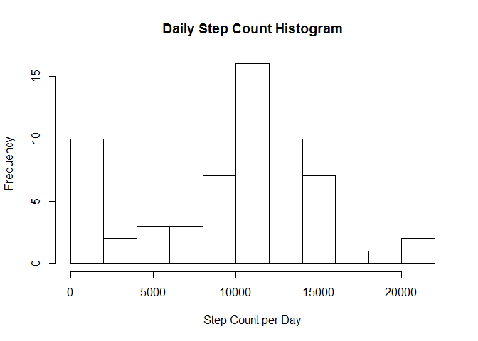
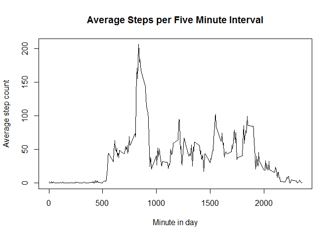
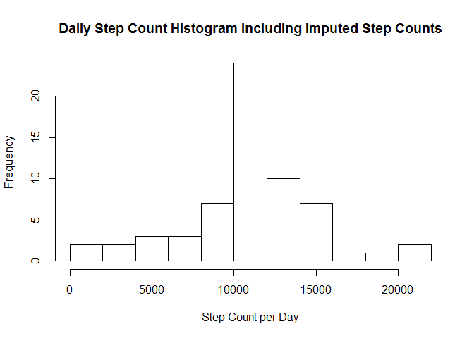
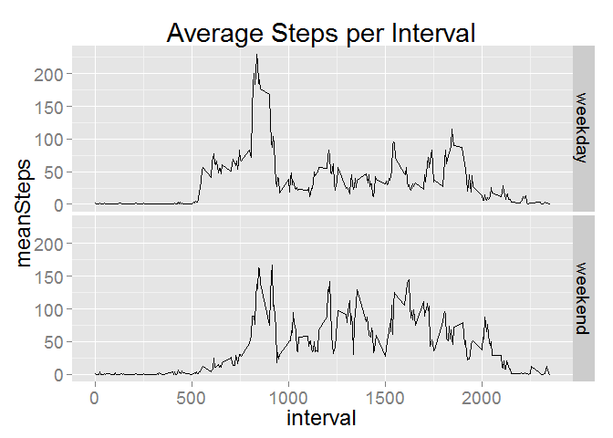

# Reproducible Research: Peer Assessment 1
Peter Mere  


```r
# Load the required packages.
require('data.table')
```

```
## Loading required package: data.table
```

```r
require('ggplot2')
```

```
## Loading required package: ggplot2
```

## Loading and preprocessing the data

Load the data into a data.table.

```r
stepDT <- read.table(unz('activity.zip', filename = 'activity.csv'), 
                     header = TRUE, sep = ',', 
                     colClasses = c('numeric','Date','numeric'), 
                     stringsAsFactors = FALSE)
stepDT <- as.data.table(stepDT)

str(stepDT)
```

```
## Classes 'data.table' and 'data.frame':	17568 obs. of  3 variables:
##  $ steps   : num  NA NA NA NA NA NA NA NA NA NA ...
##  $ date    : Date, format: "2012-10-01" "2012-10-01" ...
##  $ interval: num  0 5 10 15 20 25 30 35 40 45 ...
##  - attr(*, ".internal.selfref")=<externalptr>
```
  
***    
## What is mean total number of steps taken per day?

The daily vaiation in step count is illustrated in the following histogram.  

```r
# Summarise the data by day.
dailySteps <- stepDT[,sum(steps, na.rm = TRUE), by = date]
# Plot the histogram.
hist(dailySteps[[2]], breaks = 10,
     xlab = 'Step Count per Day', 
     main = 'Daily Step Count Histogram')
```

 


```r
# Calculate and report the mean and median total number of steps taken per day.
meanSteps <- mean(dailySteps[[2]], na.rm = TRUE)
medianSteps <- median(dailySteps[[2]], na.rm = TRUE)
```

Additionally:

* The mean number of steps per day   = 9,354.23
* The median number of steps per day = 10,395.00  
  
  **NB:** As the daily sums include NAs as zero counts, both statisics reported above would be expected to be below their true values.  
  
***  
## What is the average daily activity pattern?

The time series line plot below of the average number of steps taken in each 5-minute
interval shows the activity pattern.


```r
# Find the mean steps per intervial.
meanIntervalSteps <- stepDT[,mean(steps, na.rm = TRUE), by = interval]
setnames(meanIntervalSteps, names(meanIntervalSteps), 
         c(names(meanIntervalSteps)[1], 'meanSteps'))
plot(x = meanIntervalSteps$interval, y = meanIntervalSteps$meanSteps,
     type = 'l',
     main = 'Average Steps per Five Minute Interval', 
     xlab = 'Minute in day', 
     ylab = 'Average step count')
```

 

```r
# Find the max step count for all intervals.
maxInterval <- meanIntervalSteps[meanSteps == max(meanIntervalSteps$meanSteps),]$interval
```

The 5-minute interval starting at minute 835 contains the highest average number of steps.
  
  
***  
## Imputing missing values

```r
# Calculate the number of records with a missing step count.
naCount <- dim(stepDT[is.na(x = steps), ])[1]
```

Missing values in a data set can cause biases in the descriptive statistics drawn from it.  This data set contains 2,304 missing values.

In order to minimise the impact of the missing values, we replace them with the mean of the step measurements on the relevant interval for all days with a measurement.


```r
# Repeat the mean steps per interval once for each of the 61 days in the sample.
longMeanInt <- rep(meanIntervalSteps[[2]], times = 61)
# Make a copy of the data.
imputedSteps <- stepDT
# Replace the missing step counts in the copy with the overall average.
imputedSteps$steps[is.na(imputedSteps$steps)] <- longMeanInt[is.na(imputedSteps)]
```

The new data set is illusted in the following histogram of the total number of steps taken each day.


```r
# Sum the new step counts by date.
dailySteps_imputed <- imputedSteps[,sum(steps), by = date]  # No need for na.rm.
# Plot in a histogram.
hist(dailySteps_imputed[[2]], breaks = 10,
     xlab = 'Step Count per Day', 
     main = 'Daily Step Count Histogram Including Imputed Step Counts')
```

 

```r
# Calculate the mean and median total steps.
meanSteps_imputed <- mean(dailySteps_imputed[[2]])
medianSteps_imputed <- median(dailySteps_imputed[[2]])
```

The mean and median number of steps taken per day in the new data set are:  
* Mean steps per day   = 10,766.19  
* Median steps per day = 10,766.19  

For comparison, here are the mean and median values from the original data set:  
* Mean steps per day   = 9,354.23  
* Median steps per day = 10,395.00  

As noted earlier, these statistics are expected to be different because summing daily step count and ignoring the missing values essentially makes those missing values equal to zero.  This reduces the total step count across a number of days, and actually reduces a number of them to zero total.  The effect of this reduction is to underestimate the mean and median values.

Replacing the missing values with the mean values of the relevant interval brings the statistics closer to their true values, although not necessarily *exactly* to their true value.  Further work would be required to estimate the error in these estimates.
  
***  
## Are there differences in activity patterns between weekdays and weekends?

The figure below is a time series plot of the number of steps taken in each 5-minute interval averaged across across all weekday days or weekend days.


```r
# Prepare the data

# Add a factor variable to indicate whether or not the day is a weekend.
# First, set all rows of the factor variable to 'weekday'.
imputedSteps <- imputedSteps[, dayKind := 'weekday']
# Change the weekend days to 'weekend'
imputedSteps$dayKind[weekdays(imputedSteps$date) 
                     %in% c('Saturday','Sunday')] <- 'weekend'
# Change the variable to a factor.
imputedSteps$dayKind <- as.factor(imputedSteps$dayKind)

# Calculate the mean number of steps per day type and interval. 
meanStepsIndDaykind <- imputedSteps[, mean(steps), by = list(dayKind, interval)]
setnames(meanStepsIndDaykind, names(meanStepsIndDaykind), 
         c(names(meanStepsIndDaykind)[1:2], 'meanSteps'))

# Produce the plot
g <- ggplot(data = meanStepsIndDaykind, 
            aes(x = interval, y = meanSteps)) + 
        geom_line() + 
        facet_grid(dayKind ~ .) +
        ggtitle('Average Steps per Interval') +
        theme_grey(base_size = 18)

print(g)
```

 
  
Clearly, this person is less active on weekend mornings than they are on weeday mornings, and more active during the day on weekends compared to weekdays.
